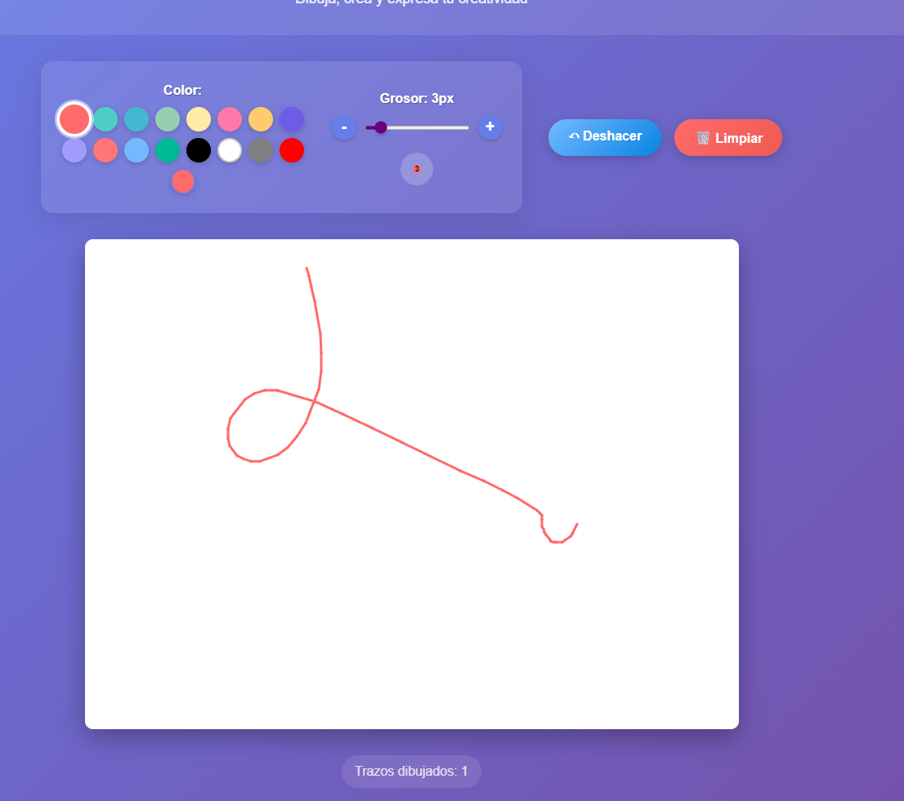

# Tablero de Dibujo Simple

Una aplicación de dibujo minimalista construida con React y p5.js.

---

## Tabla de Contenido
- [¿Qué es?](#qué-es)
- [Características](#características)
- [Diferencias con la versión colaborativa](#diferencias-con-la-versión-colaborativa)
- [Instalación](#instalación)
- [Uso](#uso)
- [Scripts útiles](#scripts-útiles)
- [Tecnologías utilizadas](#tecnologías-utilizadas)
- [Captura de pantalla](#captura-de-pantalla)
- [Licencia](#licencia)
- [Autor](#autor)

---

## 🚀 ¿Qué es?
Tablero de Dibujo Simple es una app web para dibujar de forma libre, rápida y sin sincronización entre usuarios. Cada ventana o pestaña es totalmente independiente.

---

## ✨ Características
- 🎨 Dibujo libre con el mouse
- 🌈 Paleta de colores personalizable y 16 colores predefinidos
- 📏 Control de grosor del trazo (1-20px)
- ↶ Deshacer último trazo
- 🗑️ Limpiar tablero
- 📊 Contador de trazos dibujados
- 📱 Diseño responsivo
- ⚡ Sin dependencias de red ni sockets

> **Nota:** El dibujo se mantiene solo mientras la ventana está abierta. Si recargas, se borra todo (no usa localStorage).

---

## 🆚 Diferencias con la versión colaborativa
- No hay sincronización entre usuarios ni ventanas.
- No usa sockets ni almacenamiento compartido.
- Cada usuario ve solo su propio dibujo.

---

## 🖥️ Instalación

1. Clona el repositorio:
   ```bash
   git clone https://github.com/marzo245/tablerosimple.git
   cd tablerosimple
   ```
2. Instala dependencias:
   ```bash
   npm install
   ```

---

## ▶️ Uso

1. Ejecuta en modo desarrollo:
   ```bash
   npm run dev
   ```
2. Abre en tu navegador la URL que te indica la terminal (por ejemplo, http://localhost:5173)

---

## 🛠️ Scripts útiles
- `npm run dev` — Inicia el servidor de desarrollo
- `npm run build` — Genera la versión de producción
- `npm run preview` — Previsualiza la build
- `npm run lint` — Linting del código

---

## 📦 Tecnologías utilizadas
- React 19
- p5.js
- Vite
- CSS3

---

## 📸 Captura de pantalla



---

## 📝 Licencia

Este proyecto está bajo la licencia MIT. Consulta el archivo [LICENSE](LICENSE) para más información.

---

## 👤 Autor
Hecho con ❤️ por [marzo245](https://github.com/marzo245)
